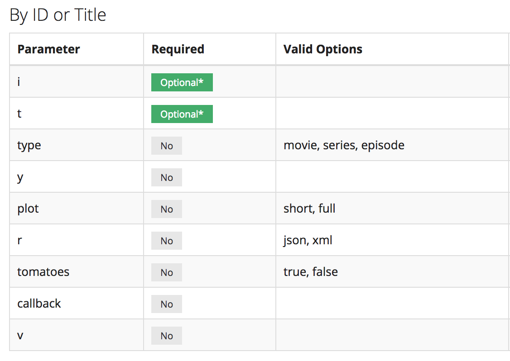
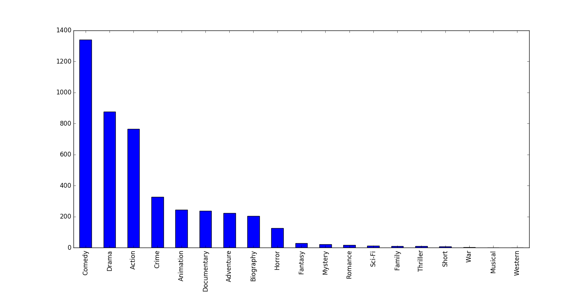
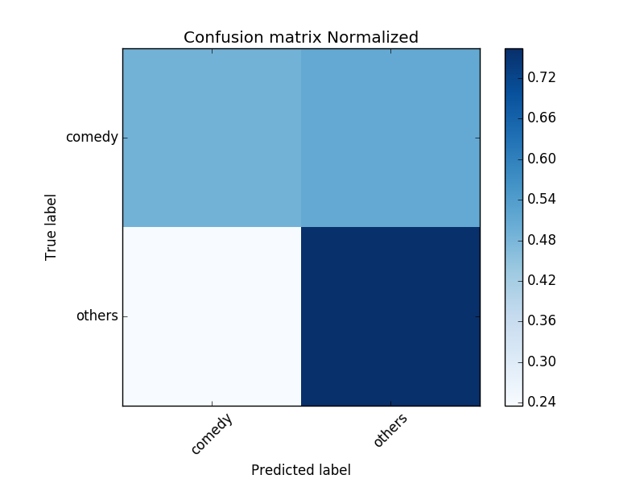

# Movie Genre Classification using Plot

## Abstract
Websites like Netflix and HBO Go, provide lists of movies based on
genres, this makes it easier for user to select the movie that interests
him/her based on the genre he/she is more inclined towards. Tagging of
movies is a complex process and usually involves a manual process where
the movies are assigned to one or more Genres based on the suggestions
sent by the users and consumers. If we can automate this process of
movie tagging, not only will it be fast , save human effort but it will
be more accurate than an untrained human as well.

Introduction
============

Predicting movie Genres is a multilabel classification problem where a a
movie can be tagged to more than one Genres.For the sake of simplicity,
we will be predict whether a movie belongs to a particular Genre or not
(one-vs-rest approach) by the end of this project using various data
mining and machine learning processes. We will collect data using one of
many available apis on internet and compile a data set which will be
primarily based on IMDB data. We will rely on text analysis of the
Plot/Summary of the movie data collected and train our classifier using
text analysis techniques.

Related Work
============

There is paper published by Ka-Wing Ho called “Movies’ Genres
Classification by Synopsis” which investigated four different approaches
for automated movies’ genres classification based on their synopsis. The
methods used in the paper are SVM, Multi-label K-nearest neighbor,
Parametric Mixture Model and Neural network. I have based some of my
ideas from this paper whereas the dataset I have used is completely
created by me and is fetched from the internet using a web-api.

Data Collection
===============

I used a web api to build my data set. The name of the web api that I
used is OMDB api as shown in Figure 1. This api is capable of returning
all the the data about a movie/series in a json/xml format given the
imdb id of the movie. I started with a seed title ID and kept on
increamenting it until I reached the target number of movies.

Features Selected
-----------------

Although the api returns a lot of data about the movies/series, I just
selected some features out of the whole set which are as follows :

* Movie ID
* Plot : Full (choices were Short or Full)
* Genre

There are movies which are associated with more than one Genre and there
can be as much as 4 Genres. I selected the first one as the main Genre
and based my findings on that.

Pruning
-------

The process to cache all the data into a CSV file had a logic where
movies were pruned and only those titles were selected which :

* Were of ‘Movie’ type
* Length of plot string was more than 50
* Genre is not equal to ‘N/A’ (there were some cases with this value)
* Language is ‘English’

Numbers
-------

Here are some numbers for my data:
* Number of titles collected : 4456
* Genres Collected : 19

|               |               |       |
| ------------- |:-------------:| -----:|
| Comedy      | Action        | Drama |
| Animation   | Documentary   | Adventure |
| Biography   | Horror        | Fantasy |
| Mystery     | Romance       | Sci-Fi |
| Family      | Thriller      | Short |
| War         | Musical       | Western |
| Crime        |              |       |        

The distibution of movies towards different genres is shown in figure 2.
As you can see that the number of comedy records is way more than any
other genre, hence we will use comedy as our main genre in our
one-vs-all approach. Note that comedy movies constitute for about 25
percent of the movies in the total set, therefore , if we just have a
naive classifier which classifies all the movies as comedy movies, we
will still have an accuracy of 25 percent of the total genres. We have
to do a lot better than that in order to produce useful trends.

Data Preprocessing
==================

After all the data was collected, some preprocessing was done on it:

* Any/all use of HTML tags were removed using BeautifulSoup library.
* Punctuation, Numbers and special characters were removed using a regex find and replace.
* All the stop words which were irrelevant to the context were removed using stopwords from Natural Language Toolkit (NLTK)

Data Mining
===========

I used a 90-10 train-test split ratio for test and train sets
respectively. After the split, the number of testing records were found
to be : 446. And its distribution is shown in figure 3.

Note that the distribution is shown just for comedy records vs other
records since we are using one-vs-rest approach where we will test
comedy records against all the other records.

All the preprocessed plot strings were then converted to bag of
Words(bow) form and various Machine learning methods were applied.

I used scikit-learn’s pyhton bindings to apply these methods, the
results are as shown below:

Machine Learning Methods
------------------------

SVM
---

Given a set of training examples, each marked as belonging to one or the
other of two categories, an SVM training algorithm builds a model that
assigns new examples to one category or the other, making it a
non-probabilistic binary linear classifier. An SVM model is a
representation of the examples as points in space, mapped so that the
examples of the separate categories are divided by a clear gap that is
as wide as possible

Results:

  --------------- -------
  **Accuracy**    0.675
  **Precision**   0.5
  **Recall**      0.489
  **F Measure**   0.495
  --------------- -------

Logistic Regression
-------------------

Logistic Regression is a type of regression model where the dependent
variable (target) has just two values

Results:

  --------------- -------
  **Accuracy**    0.657
  **Precision**   0.471
  **Recall**      0.462
  **F Measure**   0.467
  --------------- -------

K Nearest Neighbors
-------------------

K nearest neighbors is a simple algorithm that stores all available
cases and classifies new cases based on a similarity measure (e.g.,
distance functions)

Results:

  --------------- -------
  **Accuracy**    0.639
  **Precision**   0.431
  **Recall**      0.344
  **F Measure**   0.383
  --------------- -------

TFIDF
-----

Although the results were fairly good for the earlier methods but still
the accuracy was not jumping the 70 percent mark and hence I decided to
introduce another preprocessing step.

To further improve the results, the BOW representation was enhanced by
computing TFIDF (Term frequency inverse document frequency). TFIDF not
only takes into account the frequency of each word in the vocabulary but
also the weight associated with each word in the vocabulary to further
improve the results. It is given by the formula :

where, wki is the frequncy of the k-th word in the i-th movie’s synopsis
(di) and m is the number of training/test sets.

SVM with tfidf
--------------

After applying tfidf, there was a significant jump in the efficiency of
the algorithms, I could see not only increase in terms of accuracy but
also there was an improvement in the precision, recall and f-measure
values. Here are the results :

  --------------- -------
  **Accuracy**    0.758
  **Precision**   0.694
  **Recall**      0.455
  **F Measure**   0.55
  --------------- -------

Logistic Regression with tfidf
------------------------------

There was also an increase in the performance for logistic regression
with tfidf,

Results:

  --------------- -------
  **Accuracy**    0.733
  **Precision**   0.614
  **Recall**      0.482
  **F Measure**   0.54
  --------------- -------

K Nearest Neighbors with tfidf
------------------------------

KNN almost perfomed the same even with tfidf and there was no
improvement in the results.

Results:

  --------------- -------
  **Accuracy**    0.639
  **Precision**   0.42
  **Recall**      0.324
  **F Measure**   0.368
  --------------- -------

Conclusions
===========

Here is a summary of all the results:

As you can see from this table, the best accuracy was achieved by using
SVM with tfidf and an accuracy of **75.8** was achieved.

Limitations and future work
===========================

Since right now, the data set is not that large because I just created
this as a prototype for this approach, therefore this data set can be
increased to have more variation in genres which can improve the
results. Also more data preprocessing steps such as data stemming and
word repetitions can be implemented to increase accuracy of the model.
We can also take into consideration multiple genres associated with a
single movie as an enchancement to the current method of just using the
main genre and also expand the current methods from (one-vs-rest, here
‘Comedy’ vs ‘Others’) to include more genres in the future.

